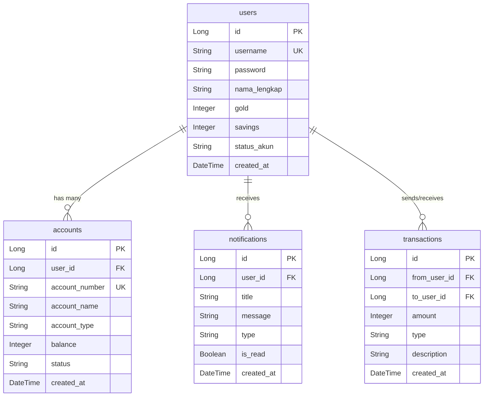
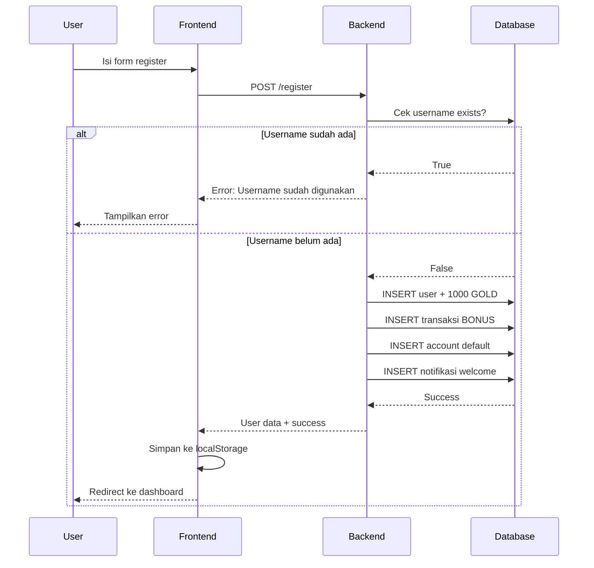
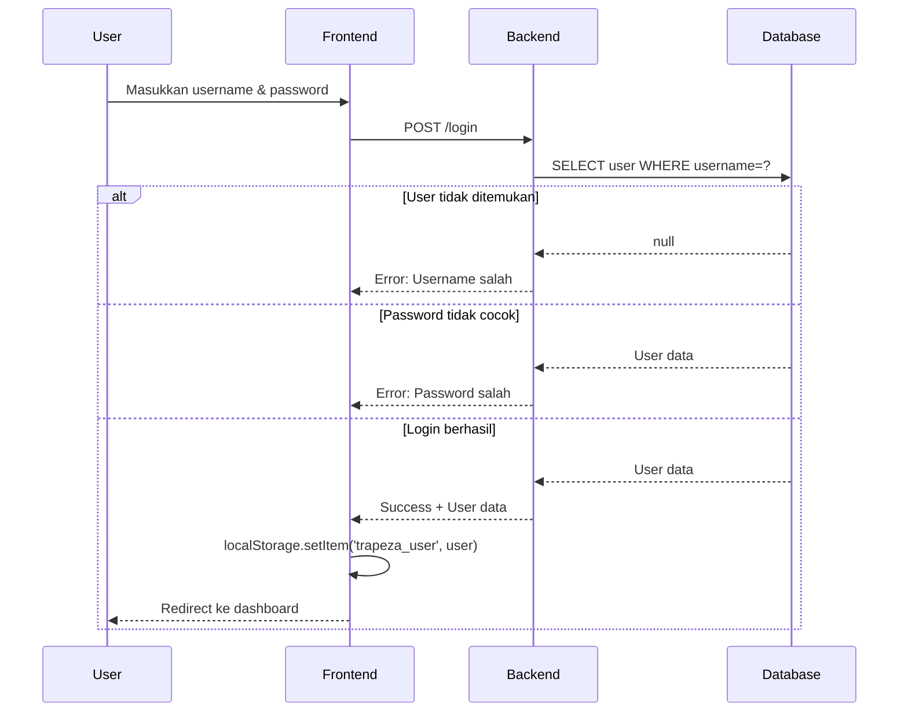
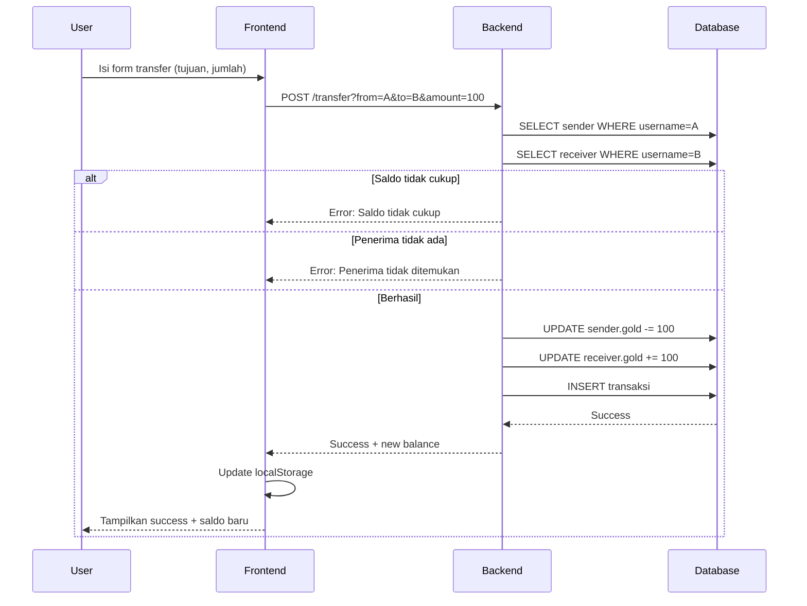
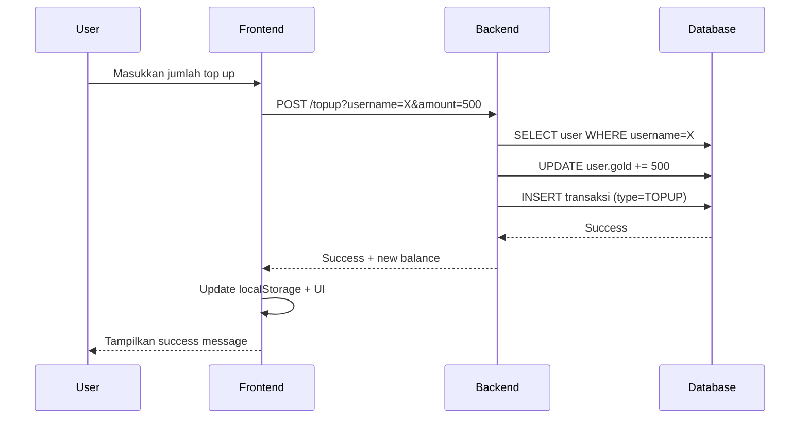
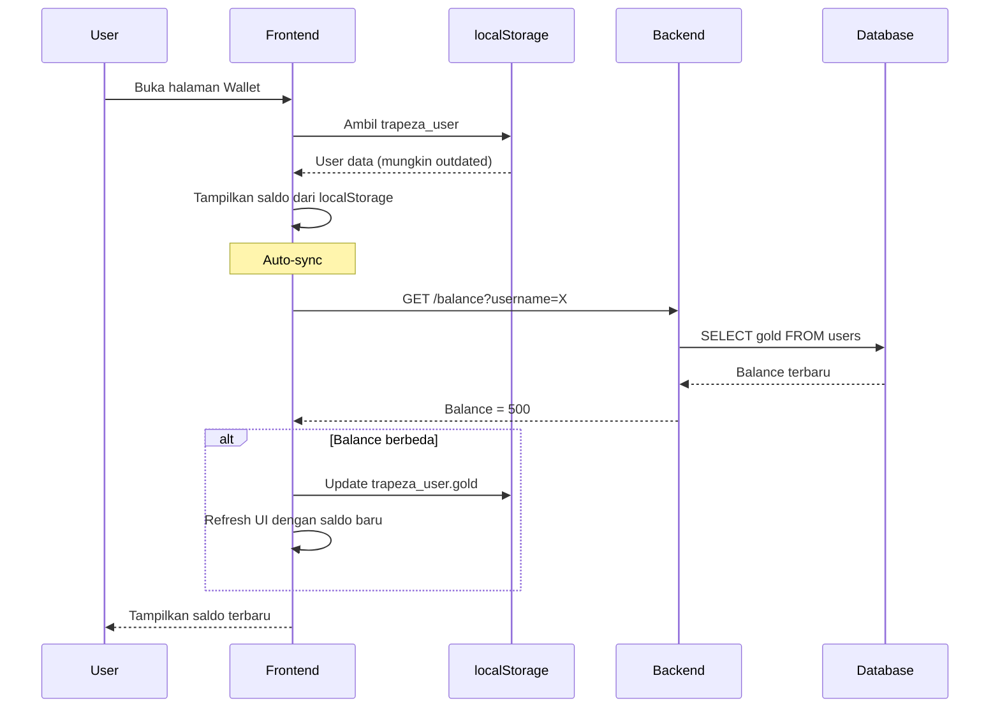

# 🏦 Trapeza Bank - Dokumentasi Lengkap Project

Panduan lengkap tentang bagaimana project Trapeza Bank bekerja dari A sampai Z.

---

## 📋 Daftar Isi

1. [Gambaran Umum](#1-gambaran-umum)
2. [Teknologi yang Digunakan](#2-teknologi-yang-digunakan)
3. [Struktur Project](#3-struktur-project)
4. [Database Schema](#4-database-schema)
5. [Arsitektur Sistem](#5-arsitektur-sistem)
6. [API Endpoints](#6-api-endpoints)
7. [Flow Aplikasi](#7-flow-aplikasi)
8. [Cara Menjalankan Project](#8-cara-menjalankan-project)

---

## 1. Gambaran Umum

**Trapeza Bank** adalah aplikasi **mobile banking sederhana** yang dibuat untuk pembelajaran. Aplikasi ini terdiri dari:

| Komponen | Teknologi | Lokasi |
|----------|-----------|--------|
| **Backend (API)** | Spring Boot + Java | `src/main/java/...` |
| **Frontend (UI)** | HTML + CSS + JavaScript | `frontend/` |
| **Database** | MySQL | `trapeza_db` |

### Apa yang Bisa Dilakukan?

- ✅ Register & Login
- ✅ Cek Saldo
- ✅ Top Up Saldo
- ✅ Transfer ke User Lain
- ✅ Tarik Saldo
- ✅ Simpan ke Tabungan
- ✅ Lihat Riwayat Transaksi
- ✅ Notifikasi In-App
- ✅ Multi-Rekening

---

## 2. Teknologi yang Digunakan

### Backend
```
┌─────────────────────────────────────────────┐
│  Spring Boot 4.0.1 + Java 21               │
├─────────────────────────────────────────────┤
│  • spring-boot-starter-web    → REST API   │
│  • spring-boot-starter-data-jpa → Database │
│  • mysql-connector-j          → MySQL      │
│  • lombok                     → Boilerplate │
│  • springdoc-openapi          → Swagger    │
└─────────────────────────────────────────────┘
```

### Frontend
```
┌─────────────────────────────────────────────┐
│  Vanilla HTML + CSS + JavaScript           │
├─────────────────────────────────────────────┤
│  • Poppins Font (Google Fonts)             │
│  • Single Page Application (SPA)           │
│  • localStorage untuk session              │
└─────────────────────────────────────────────┘
```

---

## 3. Struktur Project

```
trapeza-api/
├── 📂 src/main/java/com/moe/trapeza_api/
│   ├── 📂 entity/           ← Model/Tabel Database
│   │   ├── User.java        ← Tabel users
│   │   ├── Transaction.java ← Tabel transactions
│   │   ├── Account.java     ← Tabel accounts
│   │   └── Notification.java← Tabel notifications
│   │
│   ├── 📂 repository/       ← Akses ke Database
│   │   ├── UserRepository.java
│   │   ├── TransactionRepository.java
│   │   ├── AccountRepository.java
│   │   └── NotificationRepository.java
│   │
│   ├── 📂 service/          ← Logic Bisnis
│   │   └── TrapezaService.java
│   │
│   ├── 📂 controller/       ← API Endpoints
│   │   └── TrapezaController.java
│   │
│   └── TrapezaApiApplication.java ← Main Class
│
├── 📂 frontend/             ← UI Aplikasi
│   ├── 📂 css/
│   │   ├── styles.css       ← Styling utama
│   │   └── login.css        ← Styling login page
│   │
│   ├── 📂 js/
│   │   ├── dashboard.js     ← Logic dashboard
│   │   └── auth.js          ← Logic login/register
│   │
│   ├── 📂 pages/            ← Halaman dinamis
│   │   ├── home.html
│   │   ├── wallet.html
│   │   ├── history.html
│   │   └── profile.html
│   │
│   ├── index.html           ← Login page
│   └── dashboard.html       ← Main dashboard
│
├── pom.xml                  ← Dependencies Maven
└── application.yaml         ← Konfigurasi Spring
```

---

## 4. Database Schema

### Entity Relationship Diagram (ERD)



### Penjelasan Tabel

#### 1️⃣ Tabel `users`
Menyimpan data nasabah bank.

| Kolom | Tipe | Penjelasan |
|-------|------|------------|
| `id` | Long | ID unik (auto increment) |
| `username` | String | Username untuk login (unik) |
| `password` | String | Password (plain text untuk demo) |
| `nama_lengkap` | String | Nama lengkap nasabah |
| `gold` | Integer | Saldo utama (1 GOLD = Rp 1.000) |
| `savings` | Integer | Saldo tabungan |
| `status_akun` | String | Status: "Aktif" atau "Blokir" |
| `created_at` | DateTime | Waktu registrasi |

#### 2️⃣ Tabel `transactions`
Menyimpan semua riwayat transaksi.

| Kolom | Tipe | Penjelasan |
|-------|------|------------|
| `id` | Long | ID unik transaksi |
| `from_user_id` | Long | User pengirim (null jika TOPUP/BONUS) |
| `to_user_id` | Long | User penerima |
| `amount` | Integer | Jumlah GOLD |
| `type` | String | TRANSFER, TOPUP, WITHDRAW, BONUS, SAVING, UNSAVING |
| `description` | String | Keterangan transaksi |
| `created_at` | DateTime | Waktu transaksi |

#### 3️⃣ Tabel `accounts`
Menyimpan rekening-rekening user (multi-rekening).

| Kolom | Tipe | Penjelasan |
|-------|------|------------|
| `id` | Long | ID unik rekening |
| `user_id` | Long | Pemilik rekening |
| `account_number` | String | Nomor rekening (auto-generate) |
| `account_name` | String | Nama rekening ("Rekening Utama") |
| `account_type` | String | SAVINGS, CHECKING, DEPOSIT |
| `balance` | Integer | Saldo rekening |
| `status` | String | ACTIVE, FROZEN, CLOSED |

#### 4️⃣ Tabel `notifications`
Menyimpan notifikasi in-app untuk user.

| Kolom | Tipe | Penjelasan |
|-------|------|------------|
| `id` | Long | ID unik notifikasi |
| `user_id` | Long | Penerima notifikasi |
| `title` | String | Judul notifikasi |
| `message` | String | Isi notifikasi |
| `type` | String | TRANSFER, TOPUP, WITHDRAW, SYSTEM, PROMO |
| `is_read` | Boolean | Sudah dibaca atau belum |

---

## 5. Arsitektur Sistem

### Bagaimana Frontend dan Backend Berkomunikasi?

```
┌─────────────────┐         HTTP Request          ┌─────────────────┐
│                 │  ─────────────────────────▶  │                 │
│    FRONTEND     │                               │     BACKEND     │
│  (Browser)      │  ◀─────────────────────────  │  (Spring Boot)  │
│                 │         JSON Response         │                 │
└─────────────────┘                               └─────────────────┘
        │                                                 │
        │ localStorage                                    │ JPA
        ▼                                                 ▼
┌─────────────────┐                               ┌─────────────────┐
│  User Session   │                               │     MySQL       │
│  (trapeza_user) │                               │   (trapeza_db)  │
└─────────────────┘                               └─────────────────┘
```

### Layer Architecture

```
┌─────────────────────────────────────────────────────────────┐
│                        CONTROLLER                           │
│  TrapezaController.java                                     │
│  • Menerima HTTP Request                                    │
│  • Mengembalikan JSON Response                              │
└─────────────────────────────────────────────────────────────┘
                              │
                              ▼
┌─────────────────────────────────────────────────────────────┐
│                         SERVICE                             │
│  TrapezaService.java                                        │
│  • Logic bisnis (transfer, topup, withdraw, dll)            │
│  • Validasi data                                            │
└─────────────────────────────────────────────────────────────┘
                              │
                              ▼
┌─────────────────────────────────────────────────────────────┐
│                        REPOSITORY                           │
│  UserRepository, TransactionRepository, dll                 │
│  • Akses ke database                                        │
│  • CRUD operations                                          │
└─────────────────────────────────────────────────────────────┘
                              │
                              ▼
┌─────────────────────────────────────────────────────────────┐
│                         DATABASE                            │
│  MySQL (trapeza_db)                                         │
│  • users, transactions, accounts, notifications             │
└─────────────────────────────────────────────────────────────┘
```

---

## 6. API Endpoints

### Base URL: `http://localhost:8080/api/trapeza`

### Authentication

| Method | Endpoint | Fungsi | Parameter |
|--------|----------|--------|-----------|
| POST | `/login` | Login user | `username`, `password` |
| POST | `/register` | Daftar user baru | `username`, `password`, `nama` |

### Balance

| Method | Endpoint | Fungsi | Parameter |
|--------|----------|--------|-----------|
| GET | `/balance` | Cek saldo | `username` |

### Transactions

| Method | Endpoint | Fungsi | Parameter |
|--------|----------|--------|-----------|
| POST | `/transfer` | Transfer ke user lain | `from`, `to`, `amount` |
| POST | `/topup` | Top up saldo | `username`, `amount` |
| POST | `/withdraw` | Tarik saldo | `username`, `amount` |
| GET | `/history` | Riwayat transaksi | `username` |

### Savings (Tabungan)

| Method | Endpoint | Fungsi | Parameter |
|--------|----------|--------|-----------|
| POST | `/savings/save` | Simpan ke tabungan | `username`, `amount` |
| POST | `/savings/withdraw` | Ambil dari tabungan | `username`, `amount` |

### Accounts

| Method | Endpoint | Fungsi | Parameter |
|--------|----------|--------|-----------|
| GET | `/accounts` | List rekening user | `username` |
| POST | `/accounts` | Buat rekening baru | `username`, `accountName`, `accountType` |

### Notifications

| Method | Endpoint | Fungsi | Parameter |
|--------|----------|--------|-----------|
| GET | `/notifications` | List notifikasi | `username` |
| POST | `/notifications/read` | Tandai sudah dibaca | `id` |
| POST | `/notifications/read-all` | Tandai semua dibaca | `username` |

---

## 7. Flow Aplikasi

### 7.1 Flow Registrasi



### 7.2 Flow Login



### 7.3 Flow Transfer



### 7.4 Flow Top Up



### 7.5 Flow Cek Saldo (dengan Auto-Sync)



---

## 8. Cara Menjalankan Project

### Prerequisites
- Java 21
- MySQL
- Node.js (untuk serve frontend)

### Step 1: Setup Database
```sql
-- MySQL akan otomatis membuat database dan tabel
-- Konfigurasi di application.yaml:
-- url: jdbc:mysql://localhost:3306/trapeza_db?createDatabaseIfNotExist=true
```

### Step 2: Jalankan Backend
```bash
cd trapeza-api
.\mvnw spring-boot:run
# Backend berjalan di http://localhost:8080
```

### Step 3: Jalankan Frontend
```bash
cd trapeza-api
npx -y serve ./frontend -l 3000
# Frontend berjalan di http://localhost:3000
```

### Step 4: Akses Aplikasi
- **Frontend**: http://localhost:3000
- **Swagger API Docs**: http://localhost:8080/swagger-ui.html

---

## 🎓 Kesimpulan

Project **Trapeza Bank** adalah contoh implementasi **REST API** dengan **Spring Boot** yang terhubung ke **MySQL** dan dikonsumsi oleh frontend **HTML/JS**. 

### Key Learnings:
1. **MVC Pattern** - Controller → Service → Repository → Database
2. **REST API Design** - GET untuk read, POST untuk create/update
3. **JPA/Hibernate** - ORM untuk akses database
4. **SPA Architecture** - Single Page Application dengan dynamic page loading
5. **localStorage** - Client-side session management

---

*Dokumentasi ini dibuat untuk project tugas kuliah - Trapeza Bank API*
